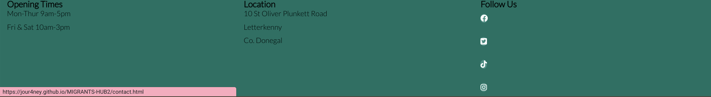

# Donegal migrants hub

Donegal migrants hub is a site that seeks to ensure newly arrived migrants in the Donegal area have access to the necessary services that will help them easily integrate to the community.

Visit the live site at [DNG MIGRANTS HUB](https://jour4ney.github.io/MIGRANTS-HUB2/)

## Contents

* [User Experience](#user-experience)
  * [User stories](#user-stories)
    * [Site Structure](#site-structure)
      * [Wireframes](#wireframes)
    * [Design Choices](#design-choices)
      * [Font](#font)
      * [Color Palette](#color-palette)

* [Features](#features)
  * [Existing Features](#exisiting-features)
  * [About Us Section](#about-us-section)
  * [Services Offered Section](#services-offered-section)
  * [Access To Online Servies Section](#access-to-online-services-section)
  * [Galler Page](#gallery-page)
  * [Contact Page](#contact-page)
  * [Footer](#footer)

  * [Future Features](#future-features)

  * [Technologies Used](#technologies-used)
*
  *[Testing](#testing)
  
  *[Deployment and Development](#deployment-and-development)

  *[Deploying the Site](#deploying-the-site)
  *[Forking theRepository](#forking-the-repository)
  *[Cloning the Repository](#cloning-the-repository)

  *[Credits](#credits)
  
    *[Content](#content)

    *[Code](#code)

    *[Media](#media)
  
  ## User Experience

### User Stories

As a user I want to:
* understand what the site is about and what help I can get from this particular organisation.
* be able to navigate intuitionally between pages.
* gain knowledge about what processes must migrants in Ireland follow and where to apply for such.
* easily obtain the information I am seeking.
* easily contactMigrants Hub for assistance.
* find some useful information that I can read on my own.

## Site Structure 

Migrants Hub is a site that consists of 4 main pages which are presented in the navigation menu. The main landing page is the [homepage]() page with primary information. The user may then opt to navigate to any of the other pages ([about us](), [services]() and [contact]()). The navigation menu sticks to the top of each page to allow easy access for users to navigate. 

### Wireframes

I created basic wireframes of how I wanted the layout of the site to look on different devices. This was done using [Balsamiq](https://balsamiq.com/).

* Wireframes were created for the homepage, about us, services and contact page. The layouts for the other pages were adopted from these so I did not find it neccessary to create separate wireframes that were nearly identical.
* The final version of the site differs in some ways due to changes that were made during the development.
    * The biggest difference 
    * This change was made to 

#### About Us Page Wireframes

#### Services Page Wireframes
inks Page Wireframes

#### Contact Page Wireframes

[Back to top](#contents)

## Design Choices
### Font

* The font used for the logo and headings is "Lato" with "sans-serif" as secondary font.
    * This font is slightly elongated, it always brings contrast to a typography combination and it's legibility is good for mobile version content consumers.  
* The font used in the body is "Oswald" also with "sans-serif" as secondary font.
    * This font complements the headings and logo and is well defined making it easy to read.

[Back to top](#contents)

### Colour Palette

The colour scheme was chosen starting with a shade of brown and then using  I found colours that compliment it and are suitable for the refugees theme.

* The  is used in the header and footer as well as a few borders and backgrounds on links and buttons.
* The  works well throughout as a background colour and font colour. 
* The  is used for font colour throughout creating good contrast. 

[Back to top](#contents)
## Features

 Migrants hub is designed to be simple and easy to use, it is made up of various features for both small and large screens that contribute towards this such as a responsive navigation bar and well organised page content.

[Back to top](#contents)

### Existing Features
* #### Navigation Bar 
    * Throughout all pages is a fully responsive navigation bar which includes links to each of the pages on the website.
    * It is contained in the header which is fixed to the top of the viewport which means it is always accessable to users no matter where they are on the page.
    * This will allow users to navigate between pages on all screen sizes.

[Back to top](#contents)
* #### Homepage
    * On the landing page is a background hero image with text over it describing what migrants hub is about.
    * This introduces the user to migrants hub and presents them with information on what to expect on the site.

* #### About Us Section
    * This section consists of three columns with the mission, values and success stories of Migrants Hub.
    * This section gives the user an overall insight of our mission and values, which reassures the user of what to expect and whether their needs will be met at Migrants hub.
    * It further seeks to highlight things we value and how our values have a positive impact on the users.
    

[Back to top](#contents)
 #### Services Page
    * This a page dedicated to providing users with information about the services that are offered by migrants hub.
    * The users can navigate to this page through the navigation bar.
    * This page is useful to users to gain valuable information about assistance they can get at migrants hub.

[Back to top](#contents)
* #### Contact Us Page
    * The contact page is accessible through the navigation menu.
    * It contains a form which the user can fill out to get in touch with migrants hub.
    * The form includes inputs for the users name, email-address,phone number as well as a textarea which the user may use to send a message or explain why they are contacting migrants hub.
    * At the bottom of the form is a submit button.
    * Upon completion the user clicks the submit button which directs them to a page confirming the form has been sent.
    * This page is useful as it creates a way for users to stay in touch.

[Back to top](#contents)
[Back to top](#contents)

* #### Form Sent Page
    * This is where the user is directed to after submitting the contact form.
    * It conveys a message to the user thanking them for getting in touch and stating that migrants hub will reply as soon as possible.
    * It contains a link which users can click on to return to the home page, or they may opt to use the navigation bar as it is also present in this page.
    * This page is useful to users as it provides confirmation that their form and information has been submitted and provides the user with reassurance.

[Back to top](#contents)

* #### Footer
    * The footer is located at the bottom of each page and is identical througout the site.
    * It indicates that the end of the page has been reached.
    * It provides the user with migrants hub address, opening times and social media links that open in a separate tab and helps the user stay in contact through social media.

[Back to top](#contents)

### Future Features

* A "gallery" page where users can see the events and workshops that we host and give a glimpse of what to expect.
    * A "volunteer" page where users can sign up to become volunteers at migrants hub.
    * Upcoming events page to keep user well informed of events,workshops and training that they are interested in being part of.
 

[Back to top](#contents)

## Technologies Used

* [HTML5](https://html.spec.whatwg.org/)
    * Used to create website structure and content.
* [CSS](https://www.w3.org/Style/CSS/Overview.en.html)
    * Used to style the html.
* [Gitpod](https://www.gitpod.io/#get-started)
    * Used to create code and repository content.
* [Github](https://github.com/)
    * Used to store the repository and deploy the site.
* [Balsamiq](https://balsamiq.com/wireframes/)
    * Used to create wireframes.

[Back to top](#contents)
## Testing

Please click [here]() for more information on testing Migrants Hub.

## Deployment and Development

### Deploying the Site

*  The deployment of the site was done through github pages through the following steps:
    1. In the rhino-aid github repository, click on settings.
    2. Scroll down and select the pages tab.
    3. In the branch dropdown menu, select "main".
    4. Click save.
    5. Refresh the page to view deployed website link.

The repository link is [here]()

[Back to top](#contents)

### Forking the repository
* Forking the repository can also be done on github.
    * Forking may be done in order to create a copy of the repository if one wishes to edit it without making changes to the original repository.
    * This can be done through the following steps:
    1. In the rhino-aid repository, find the "fork" tab in the top right corner.
    2. Click on the "fork" tab.
    3. Click on "create fork".

[Back to top](#contents)

### Cloning the repository
* Cloning the repository can also be done on github.
    * Cloning a repository may be done in order to create a local copy on a computer.
    * This can be done through the following steps:
    1. In the rhino-aid repository, click on the "code" tab located just above the list of files and next to the gitpod button.
    2. Ensure https is selected in the dropdown.
    3. Click on the clipboard icon under https to copy the url.
    4. Open Git Bash.
    5. Change the current working directory to the location where you want the cloned directory to be created.
    6. Type in "git clone" followed by pasting the url that was copied from the repository.
    E.g.  "git clone https://....."
    7. Press enter to create the clone.

[Back to top](#contents)

## Credits

### Content
* Fonts were taken from [Google Fonts](https://fonts.google.com/)
* The icons used throughout the site were from [font awesome](https://fontawesome.com/)
* The colour palette was generated using [coolers]()
* A guidline and ideas of content to be included in the readme.md came from [this readme](https://github.com/EwanColquhoun/wawaswoods#readme) example and [The code institute template](https://github.com/Code-Institute-Solutions/readme-template) 
* Information on how to fork and clone repositories was researched at [Github Docs](https://docs.github.com/en)

[Back to top](#contents)

### Code
* Instructions and ideas on most of my code came from various sources like you tube videos, W3School as well as code institute class notes.
* Html code for the social links in the footer was taken from the [love running project](code institute class notes)

### Media
* Images used throughout the site were taken from [pexels](https://www.unsplash.com/)
* I used [TinyPNG](https://tinypng.com/) to compress images.

## Acknowledgements

The Migrants Hub site was developed for the purpose of being a portfolio project for the [Code Institute](https://codeinstitute.net/global/) course in Full Stack Software Development. I would like to thank the following for support throughout the development process:

* The Code Institute community as a whole, including staff and students.
* My peers and friends who supported me and gave feedback.
* My mentor  for support and advice during development phases.

Sebenzile Mbambo 2023

[Back to top](#contents)